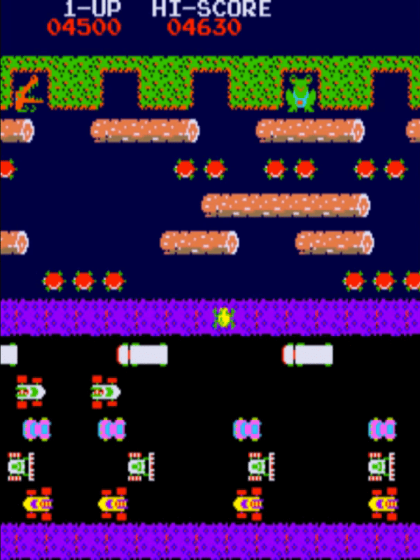

# Task List
* [x] Setup a Maven-JavaFX project
* [ ] Tests with Junit
* [ ] Refactor (sort Magic Numbers, reduce If-Conditions, follow SOLID and DRY principles)
* [ ] MVC Design Pattern
* [x] Scene manager framework
* [ ] Levels (Factory Design Pattern)
* [ ] Main menu
* [ ] High score engine and file saving
* [x] Improve graphics
* [ ] Final refactor/clean-up
* [ ] Comments and Javadocs
* [ ] README file (change log)
* [ ] Version control with Git and Github.  
* [ ] Class diagram
* [ ] Video presentation

# Change Log
All notable changes to this project will be documented in this file using the semantic versioning scheme.
Types of changes => Added, Changed, Removed, Fixed.

### [0.1.0]
* Created maven project using javafx-maven-archetypes. Added JavaFX dependencies in pom.xml.
* Reorganised project files. Moved game assets to separate resources' directory.
* Removed non-essential images and edited and added useful images.
* Renamed 'Animal.java' to 'Player.java'.
* Renamed 'Obstacle.java' to 'Vehicle.java'.
* Enabled Up, Down, Left, Right arrow keys along with A, W, S, D keys to control sprite.

### [1.0.0]
* As this is a single player game, only one instance of the player represented by 'frog' is required. Hence, changed 'Player' class to follow the Singleton design pattern.
* Implemented Model, View, Controller (MVC) pattern. 'GamePlayController' is responsible for level object creation and instance of 'MyStage' (which is a custom scene) is created in 'GamePlayView.fxml'.
* 'Main.java' is now only responsible for changing between different scenes in the application.
* Changed project file structure and 'module-info.java' such that all .fxml files can be found from the resources' directory in the 'Views' folder and all controllers can be found in the 'Controllers' package. 
* Added a Scene Manager to easily switch between different scenes.
* Added Main Menu. 
* Added an exit confirmation box.

### [2.0.0]
* As it was, the code had lots of magic numbers. Added an underlying grid structure to eliminate magic numbers and easily change position of objects by changing few variables only. 
  Using a tile size of 50. The screen is now 600px by 800px big.
* Added an 'ImageLoader' class, to load all images prior to playing the game. Firstly, this separates logic of creating the object and viewing it (MVC). Secondly, it prevents lags during game play.
* Resized all the sprites to follow the new measurements. 
* Added sprite sheets which easier to manage compared to single images.
* Added 'GetImageFromSpriteSheet' class to retrieve a particular frame from sprite sheet using JavaFXs pixel reader and writer methods.
* Added new types of objects (e.g. 5 types of Vehicles, alligators, bugs) and sprites to follow the original game design by Konami. 
* Added 'Sprite Animation' class to manage sprite sheet animations (e.g. car/water death and turtles animations).

# Screenshot of Game

